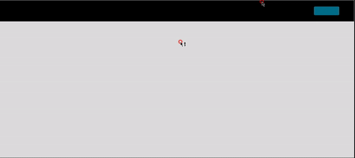
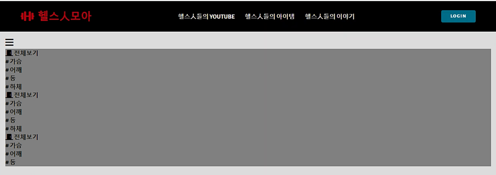
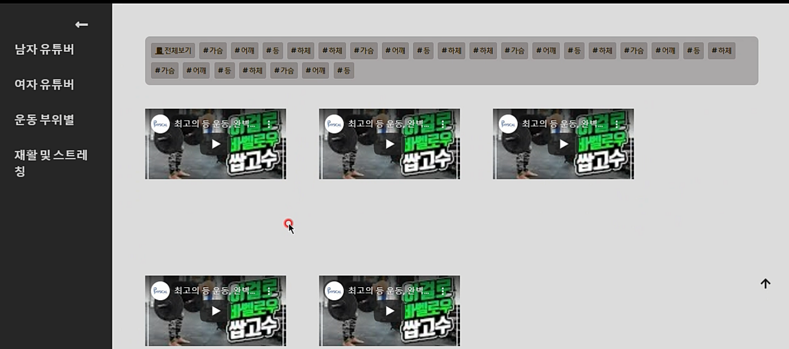

#### [200713] 프로젝트 시작

- main page 설계도 그리기

- navbar 구현하기

- 헬스들의 YOUTUBE 카테고리의 sidebar menu 구현하기

  

[☞github commit](https://github.com/DevLimK1/HealthInMoaPrj/commit/3ea6b07a047e6f4f088655ec233fc159b1fdf303)

---

#### [200714] tags-space , footer 구현

- footer 구현
- 운동 부위별 카테고리 tags-section 틀 구현




[☞github commit](https://github.com/DevLimK1/HealthInMoaPrj/commit/1f8d808164ea98f16cbd3cb7214515941829cdbe)

---

#### [200716] videos section 구현중

- tags section 구현

- videos section 구현중



---

#### [200717] videos section 구현중

- youtube api 적용하는 방법 연습중
- youtube 전체 및 카테고리별로 영상 가져오는 방법 생각해보자

---

#### [200720] videos searchApi

```
(녹)200720 ~18h20m HealthInMoaPrj 
- videos searchApi 연습 
https://www.youtube.com/watch?v=EAyo3_zJj5c 참고
- main 페이지 유튜브 영상 틀 부트스트랩 적용 화면 수정
```

---

#### [200721]  videos section 썸네일 이미지 가져오기

```
(녹)200721 14h10m~16h30m HealthInMoaPrj 
- video 영상을 data api로 가지고 오는 것이 화면에 렌더링하는데 시간이 딜레이되는 경우가 있다.
썸네일 이미지를 가지고 오는것이 어떨까해서 구현해 보는 중이다.
- 썸네일까지 가지고 오는 것은 해결, 영상하나의 이미지에 어떤 정보들을 보이게 할지, 태그는 어떻게 구분해서 넣을지 고민해볼 것
```


---

#### [200722] 태그에 맞는 제목의 유튜브 영상 출력하기

```
(녹)200722 12h00m~15h30m  HealthInMoaPrj
- 태그 제목에 맞게 비디오 이미지 가져오기 구현중(1)
(녹)200722 15h30m~16h20m  HealthInMoaPrj
- 태그 제목에 맞게 비디오 이미지 가져오기 구현중(2)
- 한명 유튜버 채널로 태그에 맞춰서 영상 출력 성공
```